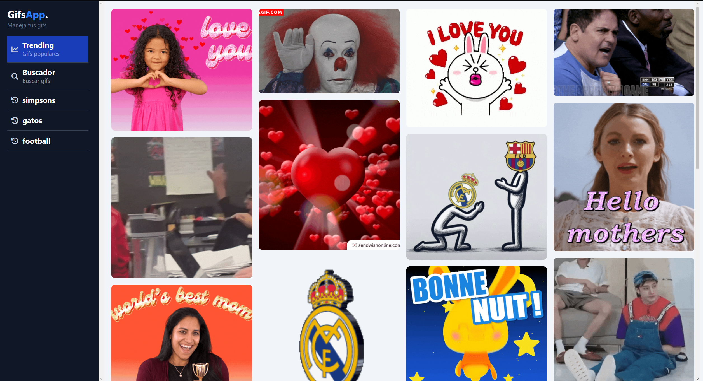

Español | [English](README.md)

# GifsApp

[](https://angular.dev/)
[](https://www.typescriptlang.org/)
[](https://tailwindcss.com/)



<br>

Este es un **proyecto de aprendizaje y práctica** construido con **Angular 21** como parte del **curso de Angular de DevTalles (Fernando Herrera)** para explorar el manejo de datos dinámicos y el consumo de APIs. La aplicación permite a los usuarios buscar, descubrir y gestionar GIFs en tiempo real, centrándose en la persistencia de estado y la arquitectura de componentes modulares.

<br>

## Tecnologías

- Angular 21
- TypeScript
- HTML / CSS
- API de Giphy Developers

<br>

## Aspectos Técnicos Destacados

- **Integración con Giphy API:** Implementación de consultas de búsqueda en tiempo real y obtención de tendencias utilizando el `HttpClient` de Angular.
- **Historial y Persistencia:** Desarrollo de un sistema de historial de búsqueda que persiste entre sesiones del navegador mediante **LocalStorage**.
- **Arquitectura Basada en Servicios:** Lógica de gestión de datos centralizada en servicios para garantizar una "Única Fuente de Verdad".
- **UI Modular:** Organización en módulos especializados (Gifs, Shared) para una mejor escalabilidad.
- **Seguridad de Entorno:** Gestión robusta de claves de API mediante archivos de entorno y buenas prácticas con `.gitignore`.

<br>
    
## Instalación

1. Clonar el repositorio:

   ```bash
   git clone https://github.com/Antonio-Borrero/gifs-app-angular.git
   ```

2. Instalar dependencias:

   ```bash
   npm install
   ```

3. Configurar variables en entorno:

   ```
   ng generate environments
   ```

   - Luego, utiliza **src/environments/environment.example.ts** como plantilla para crear el archivo **environment.development.ts** y añadir la API key de Giphy.
     > ⚠️ **Importante:** No subir la API key real al repositorio.

4. Ejecutar la app en modo desarrollo:
   ```bash
   ng serve
   ```
5. Abrir en el navegador:
   - Ir a http://localhost:4200/.
   - La aplicación se recargara automáticamente cuando se modifique alguno de los archivos

<br>

## Estructura del proyecto

```bash
   - src/
  ├───app
  │   ├───gifs                 # Módulo principal para la funcionalidad de GIFs
  │   │   ├───components       # Componentes de UI (Grid, tarjetas, menú lateral)
  │   │   ├───interfaces       # Interfaces de TypeScript para las respuestas de la API
  │   │   ├───mapper           # Lógica para transformar datos de la API a modelos internos
  │   │   ├───pages            # Vistas principales (Dashboard, Historial, Tendencias)
  │   │   └───services         # Lógica de negocio e integración con la API de Giphy
  │   └───shared               # Recursos compartidos
  │       └───services         # Servicios globales (ej: gestión de LocalStorage)
  └───environments             # Configuración de la app y claves de API
```

<br>

## Aprendizaje

- **Parámetros de peticiones HTTP** y flujos de datos reactivos.
- **Lógica de historial** (limitación de resultados, valores únicos, persistencia).
- Decoradores **Input/Output** para la comunicación entre componentes.
- Refactorización hacia el **estado global** en Servicios.
- Gestión de **Rutas** y componentes.
- Buenas prácticas en **.gitignore** y gestión de claves de API.

<br>

## Producción

Para construir la version de producción:

```bash
ng build
```
